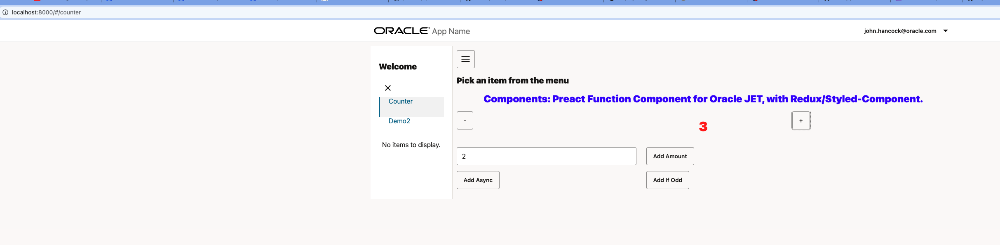

# Starter Oracle JET template with JSX, Webpack and more
Come from the world of ReactJS/ReduxJS and can't bare KnockoutJS? Here you are.

- Oracle JET 13
- Micro-frontend
    - Webpack Module Federation
- Preact X 10
    - React Function Component
    - React hooks
- Redux
    - Redux Toolkit
    - createSlice
- Styled Component
- Router Router v6
    - Lazy loading
- Sourcemap
    - Fixed JET Sourcemap issue with JSX

